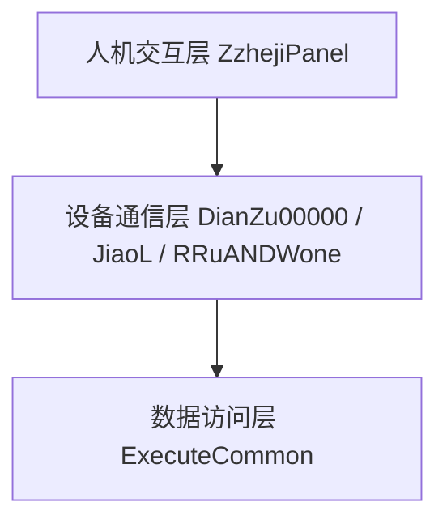
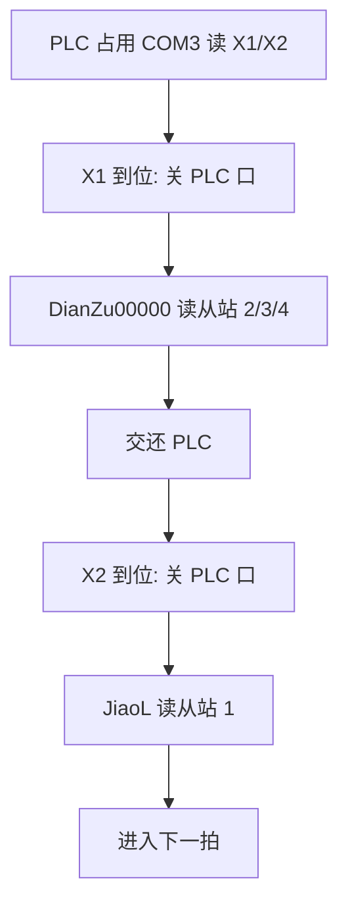
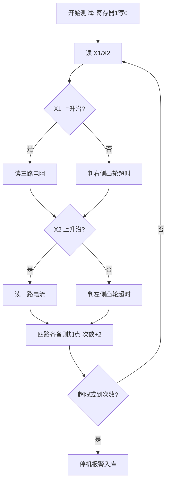
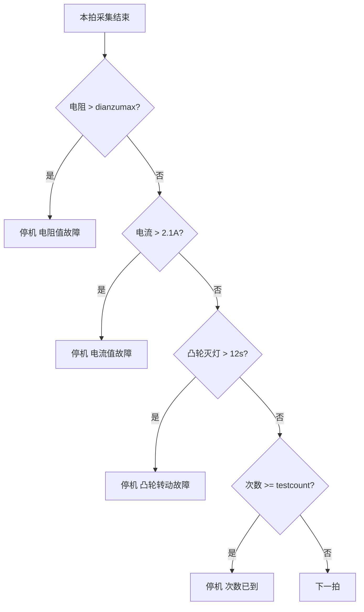
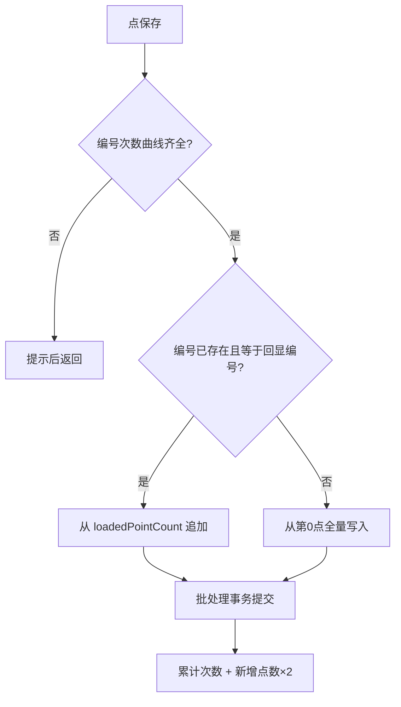
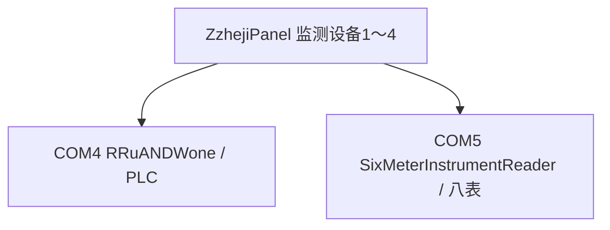
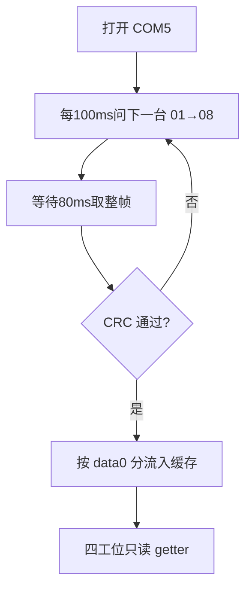
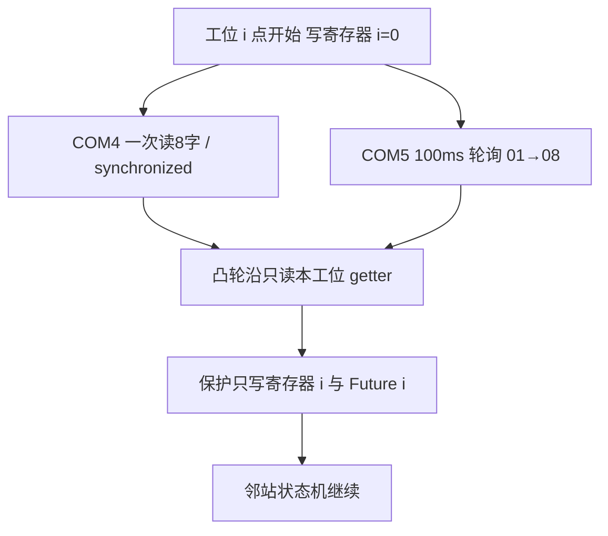

# 继电器接点寿命测试软件
# 功能实现与关键技术分析

课题报告整理稿。整理日期：2026年7月。

依据源码：`ZzhejiPanel.java`、`DianZu00000.java`、`JiaoL.java`、`ExecuteCommon.java`。第 16～18 节另据 `SixMeterInstrumentReader.java`、`ZzhejiPanel-20260811.java`。第 18 节按论文体例给出模块框图与关键算法。

## 摘要

该软件是一套电气接点寿命试验的自动测试与实时监测系统。系统以 PLC/IO 状态识别机械动作阶段，分时读取三路接触电阻和一路电流，完成实时显示、趋势分析、联锁停机、故障记录和历史追溯，形成“控制—采集—分析—报警—存储—追溯”闭环。后续 4 拖 1 方案将控制与测量分到 COM4、COM5。各功能节用问—答写难点；第 17 节集中归纳，核心题是“两串口如何拖四组独立启停的设备”。

关键词：继电器接点寿命；状态驱动采集；Modbus-RTU；安全联锁；4拖1

## 1 系统概述

该软件是一套电气接点寿命试验的自动测试与实时监测系统。系统通过 PLC/IO 状态判断机械机构的动作阶段，在不同状态下分时读取三路接触电阻和一路电流，并将采集结果用于实时显示、趋势分析、异常判断、联锁停机、故障记录及历史追溯。

功能闭环为“设备控制—状态识别—参数采集—实时可视化—异常保护—数据存储—历史数据恢复”。`ZzhejiPanel` 承担主界面与业务控制，`DianZu00000` 负责三路电阻，`JiaoL` 负责电流，并依赖 `RRuANDWone`、`ExecuteCommon`、`JdbcDeal`。

核心目标：自动控制启停；按 PLC 状态在合适阶段测量；实时采集三路电阻与一路电流；显示并绘制趋势；超限/超时/到次数时停机报警；数据与故障入库以支持续测和追溯。

**问：这套软件最难的地方是画寿命曲线，还是把采集和控制对齐？**  
答：曲线只是结果。真正难的是用 PLC 两个输入字识别机械阶段，在对应到位瞬间分时读三路电阻和一路电流，再立刻拿去比阈值、决定停机。基础版挤在一把 COM3 上完成这件事；4 拖 1 则要在两把口上让四组设备各自启停。第 17 节把这类题集中答了一遍。

## 2 总体架构

系统划分为人机交互层、业务控制层、硬件通信层和数据持久层。主界面展示状态并接收操作；业务层决定何时读设备、何时采集、何时报警；通信层通过串口和 Modbus 与 PLC、电阻模块、电流模块通信；数据层保存试验结果、累计次数和故障信息。

因多设备共享 COM3，通信采用时分复用。异常路径若未及时释放端口，下一模块可能无法通信。后续可设计统一 SerialPortManager。

图2-1 系统四层结构

图2-2 单串口时分复用流程

**问：为什么不给 PLC、电阻仪、电流表各开一个串口，而要挤在 COM3 上？**  
答：基础版现场就是一把 RS-485。三个 Java 对象都写死 `getCommPort("COM3")`，Windows 下不能同时打开。代码用“先 close 再 open”做时分复用：平时 PLC 占口读 X1/X2，到位后再把口交给仪表，读完立刻归还。异常路径若没关口，下一模块会打不开。

## 3 系统总体功能

| 序号 | 功能模块 | 主要作用 |
| --- | --- | --- |
| 1 | 测试参数与界面管理 | 显示编号、日期、次数、速度、累计次数、三路电阻、电流及按钮 |
| 2 | 测试编号与历史数据管理 | 输入新编号，或选择旧编号并加载历史曲线 |
| 3 | 测试启动/停止控制 | 切换测试状态，向 PLC 发送启停指令 |
| 4 | PLC 状态监测 | 读取两个输入寄存器，作为采集和速度计算的触发条件 |
| 5 | 三路接触电阻采集 | Modbus RTU 读取地址 2、3、4 |
| 6 | 电流采集 | 串口事件监听读取电流模块 |
| 7 | 实时曲线显示 | JFreeChart 双 Y 轴趋势图 |
| 8 | 速度与次数统计 | 用状态间隔计算速度，维护当前/累计次数 |
| 9 | 故障检测与安全联锁 | 电阻、电流、机构、次数异常时停机报警 |
| 10 | 数据保存与追溯 | 批量保存、故障记录、历史回显、续测增量保存 |

**问：十个模块里，答辩时该抓住哪几条？**  
答：三条主线：状态驱动自动测试、多源参数对齐监测、安全联锁与数据追溯。第 4～14 节和第 16 节末尾都有问—答；第 17 节把“两串口拖四组独立设备”等题再归纳一遍。

## 4 接触电阻采集

`DianZu00000` 同步轮询从站 2、3、4。打开 COM3 失败时每 50ms 重试，以便抢到 PLC 刚释放的口。对每个从站发送功能码 03H、起始寄存器 1、数量 3 的请求，等待约 50ms 后收应答。应答经 CRC-16 校验后，按原始值、小数位和单位码还原：实际值 = 原始值 / 10^小数位。单位码 3、4、5 分别对应 mΩ、Ω、kΩ。三路单位实际共用同一字段。

**问：三块电阻表共线，怎样保证问 2 的时候不会把 3、4 的应答写进电阻 1？**  
答：`readAndStoreValues()` 按地址 2、3、4 串行发 03H 帧，每问一路等约 50ms 再收。解析后用 `switch (address)` 写入 `dianZValue1/2/3`。CRC 失败返回 0。半双工上必须排队，不能三路并发。

**问：原始整数怎样变成 12.34 mΩ，又怎样拿去和阈值比较？**  
答：`rawValue = (data[3]<<8)|data[4]`，再除以 `10^data[6]`，`data[8]` 决定 mΩ/Ω/kΩ。界面显示带单位字符串，主界面 `extractNumber()` 抠出 `pureValue` 再和 `dianzumax` 比。

## 5 电流采集

`JiaoL` 访问从站 1，组帧方式与电阻相同，收数采用串口监听。单位码 3、4 分别对应 mA、A。主界面调用顺序为：打开并请求 → 睡眠 200ms → 读取缓存字符串 → 关闭串口。电流数字由 `"1.85 A"` 按空格拆出第一段得到。

**问：电流用监听、电阻用轮询，怎样保证问完一次就能关口、还不卡界面？**  
答：`JiaoL.startReading()` 打开 COM3 后只发一帧，靠 `SerialPortDataListener` 收应答，监听里 sleep 100ms 等整帧。主界面再睡 200ms，取 `getJiaoLZValueWithUnit()`，立刻 `stopReading()`。单位码不是 3/4 则返回 0。

**问：电阻同步、电流异步，怎样对齐成同一个采样点？**  
答：电流先写入隐藏框 `dianzu444NO`，电阻读完再抄到显示框。四个显示框共用 DocumentListener，三阻一电都非空才在同一 `timeSeconds` 上加点。

## 6 PLC通信与控制

PLC 地址为 0x08。上位机循环读取功能码 04H、起始 0、数量 2 的输入寄存器，直到应答功能码确认为 04H。第一字 X1 为右侧凸轮，有效时采集电阻；第二字 X2 为左侧凸轮，有效时采集电流。写寄存器 1 控制运行（0 启动，1 停机），写寄存器 2 控制报警。

**问：PLC 只给出两个输入字，怎样同时驱动采集、速度和机械超时？**  
答：X1 上升沿读三路电阻并刷新速度；X2 上升沿读电流。任一凸轮长时间为 0 就判超时。开始测试写寄存器 1 为 0；故障写寄存器 1、2 为 1。这是状态驱动，不是按固定周期扫全部传感器。

**问：点“停止测试”为什么主要写报警位，运行位却被注释掉？**  
答：else 分支 `cancel` 后台循环，写寄存器 2 为 0 消报警。寄存器 1 写 0 的语句被注释，手动停侧重停软件循环和关报警。保护停机路径才会明确把运行位写成 1。

## 7 试验流程控制

外层循环控制试验是否继续，内层循环等待本拍电阻采集完成。设计目的是先电阻、后电流，避免在电流信号保持有效时重复读表。X1 上升沿触发三路电阻采集，X2 上升沿触发电流采集，`AtomicBoolean` 用于上升沿闭锁。采集线程只刷新文本框；四个显示框共用 DocumentListener，四路均非空时才加点，次数加 2。

图7-1 试验主循环

操作员进入界面后，系统自动加载电阻停机阈值、累计动作次数和历史试验编号。输入或选择编号后启动测试，上位机向 PLC 发出运行指令。右侧行程开关有效则读三路电阻，左侧有效则读电流。四路数据齐备后曲线加点并计算速度。出现保护条件则停机入库。试验结束后按编号保存；旧编号只追加新点。退出时复位沿标志、计时器和串口。

**问：为什么必须先采电阻、再采电流，还要内外两层循环？**  
答：源码注释要求先电阻、后电流，避免电流信号保持有效时反复问表。内层等到本拍电阻采完才退出；外层立刻做电阻超限、电流超限、次数上限三道门禁。同一凸轮持续为 1 时，靠 `processed2`、`processed555111` 闭锁。

**问：串口等待会不会把界面卡死？采集线程为什么不直接往图上加点？**  
答：正式循环丢进 `ExecutorService`，停止用 `Future.cancel(true)`。界面刷新一律 `SwingUtilities.invokeLater`。采集线程只改文本框，由监听器在 EDT 上 `updateChart()`。

## 8 动作速度测算

记录相邻两次 X1 有效时刻的间隔 Δt。当 Δt 大于 2 秒时，按 v = 120 / Δt 计算每分钟动作次数。系数 120 相当于 60×2，与曲线横坐标每次步进 2 一致。

**问：速度为什么写成 120/Δt，开关抖动时会不会把次数刷飞？**  
答：代码明确是 `v = 120.0 / timeDifference`。两次 X1 间隔 2 秒就显示 60 次/分钟。系数 120 的机械含义要结合机构确认，报告里不擅自解释。只有 Δt > 2 秒才认作有效间隔；X1 回到 0 才清 `processedjishi1`。

## 9 保护停机机制

电阻上限取自 `d_dianzumax.dianzumax`，任一路超限则停机报警。电流超过 2.1A 同样停机。凸轮信号持续无效超过 12 秒判定机构故障。次数达到 `testcount` 后结束试验。故障写入 `policetime`（次数、类型、时间）。

图9-1 四类保护停机判定

**问：刚进界面、计时器还没初始化时，会不会立刻误报凸轮超时？**  
答：超时窗口写成 (12, 10000) 秒：正常节拍远小于 12 秒才会卡死报警，上限 10000 躲开计时器未赋值时的巨大时间差。

**问：四类保护触发后，怎样保证设备真停、还能追溯？**  
答：外循环实时比较，立刻写寄存器 1、2 停机报警，结束外循环，再 `saveToPolicetimeTable` 记次数、原文和时间。这不是测完再判合格，而是每拍闭环。

## 10 实时曲线监测

左侧纵坐标为电阻，右侧纵坐标为电流，横坐标为动作次数。可视窗口约 28 次。支持最近点读数、滚轮缩放、滚动浏览及分系列显隐。

**问：电阻是 mΩ、电流是 A，怎样画在一张图上还不提前画出半拍数据？**  
答：左轴挂三路电阻，右轴挂电流。采集线程不直接 `series.add`，只改四个文本框；DocumentListener 等到三阻一电都非空，才在同一 `timeSeconds` 加点，然后横坐标 +2。变量名叫 timeSeconds，实际是次数。

## 11 数据存储与回放

每个采样点对应 `test_results` 中一行。保存采用 JDBC 批处理事务。新编号全量写入，已回显的旧编号仅追加新点。保存成功后累计次数按新增点数的 2 倍增加。选择已有编号可按横坐标升序回放，并自最大次数继续试验。

图11-1 试验数据保存与回放

**问：同一试品分段试验，怎样避免把已经回显的旧点再插一遍？**  
答：回显时记下 `loadedPointCount` 和 `loadedTestBianHao`。保存时只有“编号已存在且等于当前回显编号”才从该索引追加；否则从第 0 点全量写。批插关自动提交，失败 rollback。

**问：操作员误选新编号，会不会把正在画的曲线清空？**  
答：库里没有的编号直接返回，绝不清空当前曲线。回填下拉框时先置 `loadingHistory`，避免 ActionListener 递归加载。

## 12 数据库设计

`d_dianzumax` 保存电阻阈值与最大次数；`allcount` 保存累计次数；`test_results` 保存曲线点；`policetime` 保存故障记录。阈值查询与曲线批插分别使用 `DBConnection` 和 `JdbcDeal`。

**问：阈值、曲线、故障分别怎么落库，两套连接会不会把一次保存写丢一半？**  
答：阈值和累计次数走 `DBConnection`；曲线批插和故障台账走 `JdbcDeal`。曲线写入关自动提交，成功才 commit。功能上能跑通，两套入口是后续该收成一个连接池的点。

## 13 通信协议设计

通信采用 Modbus-RTU。请求帧为地址、功能码、起始地址、数量及 CRC（低字节在前）。电阻/电流使用功能码 03H，PLC 使用功能码 04H。CRC-16 初值 0xFFFF，多项式反射形式 0xA001。

系统在 RS-485 总线上采用主从问答。因多设备共享同一串口，上位机在开关量有效时关闭 PLC 通道，再访问从站 2、3、4 和从站 1，完成后交还 PLC。校验失败的数据不进入曲线。

| 顺序 | 占用总线 | 请求帧 | 目的 |
| --- | --- | --- | --- |
| 1 循环 | PLC | 08 04 00 00 00 02 71 52 | 读 2 路输入 |
| 2 | 电阻地址 2 | 02 03 00 01 00 03 54 38 | 读接触电阻 1 |
| 3 | 电阻地址 3 | 03 03 00 01 00 03 55 E9 | 读接触电阻 2 |
| 4 | 电阻地址 4 | 04 03 00 01 00 03 54 5E | 读接触电阻 3 |
| 5 循环 | PLC | 08 04 00 00 00 02 71 52 | 继续盯 X2 |
| 6 | 电流地址 1 | 01 03 00 01 00 03 54 0B | 读回路电流 |

图13-1 一拍内 COM3 访问时序

若应答字节 3、4 为 04 D2（1234），字节 6 为 02，字节 8 为 03，则还原为 12.34 mΩ。

**问：总线上夹杂干扰时，错误读数会不会拿去比阈值、画进寿命曲线？**  
答：请求和应答都算 Modbus CRC-16（初值 0xFFFF，多项式 0xA001）。长度不够或校验失败直接丢弃。PLC 应答功能码不是 04H 就延时 10ms 重问。

**问：一拍里 PLC、三块电阻表、电流表怎样排队？**  
答：平时 PLC 用 08 04 读两路输入。X1 到位后关口，再按地址 2、3、4 各发一帧 03H；交还后再盯 X2，到位后发 01 03 读电流。半双工上必须排队。

## 14 软件结构

`ZzhejiPanel` 负责人机交互与试验状态机；`DianZu00000`、`JiaoL` 分别完成电阻与电流采集；`ExecuteCommon` 完成数据访问。界面更新位于 EDT，采集任务运行于 3 线程池，电流监听位于串口回调线程。串口互斥依赖关闭后再打开的调用顺序。

主要界面控件：编号框 `testBianHao`，日期 `testTime`，次数 `countTest`，累计次数 `allcountTest`，速度 `suduTest`，电阻 `dianzu111/222/333`，电流显示 `dianzu444`，电流隐藏缓存 `dianzu444NO`。

**问：退出后再进试验页，会不会沿用上次的线程、沿标志或串口占用？**  
答：“退出”先走 `resetForNextEnter()`：停 Timer、取消 Future、移除文本监听、关串口、复位 AtomicBoolean 和时间变量，再回 Home。否则下一次会误判凸轮超时，或打不开 COM3。

## 15 关键技术与总结

核心技术：状态驱动式测试；多源数据协同采集；后台线程与界面分离；实时质量判定与联锁保护；数据追溯与试验恢复。

答辩应突出三条主线：状态驱动自动测试；多源参数实时监测；安全联锁与数据追溯。不宜把主要篇幅放在按钮颜色和绝对坐标上。

总结表述：本系统以 PLC 机械状态为测试时序依据，通过串口与 Modbus RTU 协调三路接触电阻、电流及设备控制，在后台线程中完成自动循环测试；同时利用 Swing 和 JFreeChart 实时显示参数及趋势，并结合数据库实现测试数据、累计寿命与异常信息的持久化。出现电阻超限、电流超限、机构超时或达到设定次数时自动停机并记录故障，形成“控制—采集—分析—报警—存储—追溯”闭环。

可能被问到的问题：为什么用后台线程；为什么电阻和电流不同时读取；为什么需要 CRC；为什么使用双 Y 轴；历史续测如何避免重复保存；软件如何保证异常时停止设备。

不足：COM3 缺少统一调度器；两套数据库连接；三路电阻单位共用字段；电流阈值 2.1A 硬编码；固定分辨率绝对布局。

**问：基础版和 4 拖 1 各自最难的一句，答辩时怎么收口？**  
答：基础版是一把 COM3 上用凸轮状态把电阻和电流对齐。4 拖 1 是两把口上把问表和用数拆开，让四套状态机独立启停。第 17 节按问—答把调度、沿闭锁、增量存盘和分设备台账集中写了。

## 16 4拖1方案的多工位拓展

前十五节只分析单工位基础版。本节说明后来做成的 4 拖 1 方案：一台上位机、一块 PLC、一条仪表总线，同时拖四台监测设备。

### 方案含义

界面用 `JTabbedPane` 做成“监测设备1～4”。每台各有启停、状态灯、编号、次数、速度、电阻/电流和一张双轴曲线。接线收成两路：COM4 只连 PLC，COM5 只连八台仪表。一台超限停机，不影响邻站。

图16-1 4拖1双总线结构

### 工位对应关系

| 监测设备 | 电阻从站 | 电流从站 | PLC 凸轮输入 | 运行线圈 |
| --- | --- | --- | --- | --- |
| 1 | 05 | 01 | 第 1、5 字 | 寄存器 1 |
| 2 | 06 | 02 | 第 2、6 字 | 寄存器 2 |
| 3 | 07 | 03 | 第 3、7 字 | 寄存器 3 |
| 4 | 08 | 04 | 第 4、8 字 | 寄存器 4 |

报警共用寄存器 5。状态灯为 stop / Y / N。

### 统一仪表调度

`SixMeterInstrumentReader` 每 100ms 问一台表，地址 01→08 循环，一整轮约 800ms。监听线程 sleep 80ms 后取整帧，CRC 通过后按 `data[0]` 分流写入 `ConcurrentHashMap`。四个试验循环只读缓存，不再开关仪表口。

图16-2 八表轮询与四工位用数

### PLC 与并行试验

PLC 改挂 COM4，地址 0x01，一次读 8 个输入字：`01 04 00 00 00 08 F1 CC`。四个循环共享 `synchronized readAndProcessRegisters()`。写寄存器 1～4 分控运行，写寄存器 5 公共报警。

### 保护、曲线与台账

电阻阈值 `getDianzumaxValue1～4`，电流仍与 2.1 A 比较，凸轮 12 s 超时，次数 `getTestmaxValue1～4`。四张独立双轴图。保存用 `SwingWorker` + `LoadingGifDialog`，行末写设备号。`policetime` 增加 `Shebeihao`。这批 `ExecuteCommon.java` 仍是单记录接口，需与分设备方法对齐。

### 还可继续扩展

调度器按地址取模循环，页签是同构副本，运行线圈按工位号顺延，台账按设备号筛选。源码中残留的 COM5 上 `RRu`/`Wone` 不能与读取器同时打开。4 拖 1 能成立，关键是把问表和用数拆开，并把四套状态彻底隔离。

**问：工位数大于串口数时，如何让四套设备独立启停，并且问表期间仍能对故障工位写停机？**  
矛盾：沿用基础版“到位就关 PLC、开仪表”，四工位并发会互相踢口；保护停机也会卡在读表占用上。  
实现：COM4 专属 PLC，寄存器 1～4 分控运行；COM5 上读取器常驻轮询，凸轮沿只读 getter。每台独立线程池与 Future。  
边界：缓存最大陈旧约 800ms；报警线圈 5 仍共享。

**问：四个 while 同时读 PLC，互斥是监视器还是总线事务？邻站应答如何避免串缓存？**  
矛盾：无互斥则 COM4 重入；有互斥但各读一遍，总线浪费四倍。按发送序号入表会把迟到帧写入邻站。  
实现：`synchronized readAndProcessRegisters()` 一次读 8 字；仪表解析以帧内 `data[0]` 为准。  
边界：Java 监视器不是 PLC 事务；持锁方法里还算速度，临界区偏长。

**问：工位 2 超限时隔离的是机构、线程，还是整条仪表总线？**  
矛盾：共享读取器让“停一台”很容易变成“停总线”。  
实现：只写寄存器 2 与 Future2，COM5 调度器不停，台账带 `Shebeihao=2`。  
边界：工位 2 清寄存器 5 可能抹掉邻站报警。

## 17 重难点问题与代码解答

前面各节已经按功能写了实现。本节只收那些真正构成工程矛盾的问题。每道题按“矛盾—实现—边界”写：先说明朴素做法为什么失败，再对照源码写解法，最后点出仍未收干净的约束。

### 1）核心题：两路半双工总线如何拖四套独立状态机

**问：工位数大于物理串口数时，如何同时满足四套独立启停，并且在问表期间仍能对故障工位下发停机？**

矛盾：RS-485 半双工，同一时刻一条总线只能有一对主从问答。若沿用基础版“凸轮到位就 close PLC 口、open 仪表口”，四个试验循环并发时会互相踢掉 `SerialPort` 对象，凸轮沿丢失、保护写线圈失败。现场又只有 COM4、COM5。更苛刻的是：电阻超限必须在读表过程中仍能写停机，控制和测量不能再抢同一把口。

实现：拆成三条互不重叠的通道。  
（1）介质分离：`RRuANDWone("COM4")` 专访 PLC，`SixMeterInstrumentReader("COM5")` 专访八台仪表，问表不再关闭 PLC 口。  
（2）生产/消费解耦：读取器构造即 `startReading()`，`ScheduledExecutorService` 每 100ms 只问一台（`(queryIndex % 8) + 1`，一轮约 800ms）；监听线程 sleep 80ms 取整帧，CRC 通过后按 `data[0]` 写入 `ConcurrentHashMap`。工位循环在凸轮上升沿只调用 `getResistanceValue(5～8)`、`getCurrentValue(1～4)`，复杂度从“占口+组帧+等待”降为 O(1) 读缓存。  
（3）控制面按工位切开：写寄存器 i∈{1,2,3,4} 控制本台运行（0 启动 / 1 停机），寄存器 5 公共报警；`isTestingStarted1～4`、四套线程池、四套 AtomicBoolean 和四张曲线彼此隔离，`cancel(true)` 只停本工位 Future。

边界：缓存最大陈旧约 800ms，凸轮沿读到的是上一轮值——用时效换吞吐。四个循环共享 `synchronized readAndProcessRegisters()`，COM4 被串行化，一次读 8 字。报警线圈 5 仍是共享资源，100ms 交错写只能降低覆盖。残留 `RRu/Wone("COM5")` 一旦打开会拆掉调度器。仓库里的 `ExecuteCommon` 仍是单记录接口，分设备阈值若未对齐会读成同一行。

图17-1 控制面与测量面解耦

### 2）基础版：单总线时分、异构采集与增量持久化

**问：PLC、三路电阻、一路电流共用 COM3 时，为什么不能定时全量轮询，时分复用的互斥条件是什么？**  
矛盾：三个 Java 对象都写死 `getCommPort("COM3")`。Windows 下不能同时打开；半双工也不允许并发发两帧。定时全量轮询会在凸轮未到位时占口。  
实现：状态驱动。平时 PLC 占口读 X1/X2；仅上升沿 close 后把口交给 `DianZu00000` 或 `JiaoL`，读完立刻归还。互斥在调用顺序上的“先关后开”，不在锁对象。  
边界：协作式互斥没有 SerialPortManager。异常路径漏 close，下一模块会空转 `waitForPort()`。

**问：电阻同步、电流异步，如何在缺少公共时钟时对齐成同一个寿命采样点？**  
矛盾：谁先到谁 `series.add`，会出现有阻无流的半拍点，超限和存盘都会错位。  
实现：电流先写隐藏框 `dianzu444NO`；电阻读完后抄到显示框。四框共用 DocumentListener，四路非空才在同一 `timeSeconds` 加点。采集线程不直接碰 JFreeChart。  
边界：对齐依赖“四框非空”这一弱不变式。CRC 失败则本拍不加，超时计时仍走。

**问：Modbus 等待是阻塞 I/O，如何既不冻死停机按钮，又不在工作线程违反 Swing 单线程规则？**  
矛盾：放在 EDT 会失去停机响应；工作线程直接 `XYSeries.add` 会竞态重绘。  
实现：循环进 `ExecutorService`，`cancel(true)` 停止；文本回 `invokeLater`；加点发生在 EDT 的 `updateChart()`。写线圈仍在工作线程，避免等 UI 才停机。  
边界：`cancel` 打不断已发出的 Modbus 帧。电流回调在 jSerialComm 线程，必须先写缓存再切回 EDT。

**问：凸轮开关量在高电平上保持数个扫描周期，如何避免同一拍被重复读表、速度被重复积分？**  
矛盾：输入字是电平不是边沿。只判断 `value==1` 会把 COM3 打满，并对同一间隔连除。  
实现：三套 AtomicBoolean 做上升沿闭锁（`processed2` / `processed555111` / `processedjishi1`），回 0 才解锁。速度另加 Δt > 2 秒死区。  
边界：退出必须 `resetForNextEnter()` 清旗标。系数 120 与步进 2、累计 ×2 一致，但机械含义源码未定义。

**问：表结构没有游标列，分段续测如何只持久化新增采样点？**  
矛盾：按编号全量再插会复制历史点。  
实现：内存游标 `loadedPointCount` + 绑定编号 `loadedTestBianHao`。仅当编号已存在且等于回显编号才从该索引追加。批插事务，成功后累计 + 新增点数×2。新编号不清空当前曲线；`loadingHistory` 防递归。  
边界：游标在进程内不在库里。手动改号会走全量插入。

**问：串口干扰下，如何保证错误帧既不进入合格判定，也不污染寿命曲线？**  
矛盾：损坏的 16 位整数一次就能误停机或留下尖峰。  
实现：Modbus CRC-16（初值 0xFFFF，多项式 0xA001）。长度不足或校验失败丢弃。PLC 功能码不是 04H 则 10ms 重问。  
边界：丢弃不等于重读成功。三路电阻单位共用 `dianZUnit1`，显示可能骗人，判定用纯数值。

### 3）4拖1：总线调度、共享对象与故障隔离

**问：八台仪表共一条 RS-485，如何保证应答不会写进邻站缓存？**  
矛盾：并发八路 03H 会重叠；按发送序号入表，迟到应答会张冠李戴。  
实现：每 100ms 只问一台。解析读 `data[0]`：01～04 电流，05～08 电阻。工位映射写死。CRC 失败不覆盖旧缓存。  
边界：一轮约 800ms，掉线时工位可能用过期值做超限比较。

**问：四个试验循环同时调用 PLC 读接口，如何避免 COM4 重入，又避免四次重复扫描？**  
矛盾：各自 open 会报占用；各读一遍浪费四倍带宽。  
实现：实例方法 `synchronized readAndProcessRegisters()`，一次 04H 读 8 字，功能码不符则 10ms 重试。速度积分也按工位旗标在该方法内更新。  
边界：监视器不是 PLC 事务。方法过长，持锁时间偏长。

**问：工位 2 电阻超限时，怎样保证停的是本台机构，而不是整条总线？**  
矛盾：朴素的 `stopReading()` + 总停会让邻站失去凸轮扫描和仪表缓存。  
实现：比较本工位 `getDianzumaxValue2()`，写寄存器 2 停本台、寄存器 5 报警，只 cancel Future2。COM5 不停。入库带 `Shebeihao`。  
边界：寄存器 5 是公共报警，稍后写 0 可能清掉邻站报警。电流阈值四台仍共用 2.1 A。

基础版的本质难点是：在一把 COM3 上用凸轮电平把异构采集编排成同一拍，并用沿闭锁和增量游标保证不重读、不重存。4 拖 1 的本质难点是：把问表从试验循环里拿出去，让控制面按线圈隔离、测量面按缓存共享。图多画三张不是难点，调度、互斥和隔离才是。

## 18 模块框图与关键算法分析

本章按论文体例组织：先给出软件模块框图，再对源码中实际运行的算法作形式化描述。每一算法给出输入、输出、步骤、复杂度与正确性条件。不引入源码未出现的算法。滑动平均（窗口 5）仅存在于注释块，现行主路径为四舍五入，不列为正式算法。

### 总体模块框图

四个子系统：人机交互（`ZzhejiPanel`）、试验控制（状态机 / 沿闭锁 / 保护 / 速度 / 增量游标）、设备通信（`RRuANDWone` / `DianZu00000` / `JiaoL` / `SixMeterInstrumentReader`）、数据访问（`ExecuteCommon` / `JdbcDeal`）。控制层向通信层发出读输入、读表、写线圈请求，向数据层发出查阈值、批插、记故障请求，向交互层回写文本框，由监听器驱动曲线。

图18-1 软件总体模块框图（人机交互 → 试验控制 → 设备通信 → 数据访问）

图18-2 基础版采集控制数据流：线程池循环读 X1/X2；X1 沿问电阻 2/3/4，X2 沿问电流 1 并写入隐藏框；四路对齐后加点；外层保护写线圈；保存走增量批插。

图18-3 4拖1 调度模块：控制面 COM4 一次读 8 字并按工位写线圈；测量面 COM5 每 100ms 轮询写入 `ConcurrentHashMap`；工位只读绑定 getter；保护只 cancel 本工位 Future。

### 算法一览

| 编号 | 算法 | 所属问题 | 实现位置 |
| --- | --- | --- | --- |
| 18-1 | 状态驱动分时采集 | 单总线互斥 | ZzhejiPanel 主循环 |
| 18-2 | Modbus CRC-16 | 帧完整性 | DianZu00000 / JiaoL / SixMeter |
| 18-3 | 定点小数还原 | 量纲还原 | parseResistanceValue / BigDecimal |
| 18-4 | 上升沿闭锁 | 电平去重 | AtomicBoolean 三套旗标 |
| 18-5 | 动作频次估算 | 速度显示 | v = 120/Δt，Δt>2s |
| 18-6 | 四类保护判定 | 联锁停机 | 外层 continueLoop2 |
| 18-7 | 多源采样对齐 | 半拍点抑制 | 隐藏框 + DocumentListener |
| 18-8 | 历史索引增量持久化 | 续测不重插 | loadedPointCount |
| 18-9 | 有序最近邻查询 | 曲线读数 | findClosestDataItem |
| 18-10 | 八从站时分轮询 | 4拖1 测面 | queryIndex % 8 |
| 18-11 | 工位级隔离停机 | 4拖1 控制面 | 寄存器 i + Future i |

### 算法 18-2　Modbus CRC-16

输入：字节序列与校验长度。输出：16 位校验和，低字节在前。  
步骤：crc←0xFFFF；对每个字节异或后循环 8 次，最低位为 1 则右移并异或 0xA001，否则只右移。  
复杂度：O(8·length)。正确性：与多项式 0x8005 的 LSB-first 反射形式一致。PLC 路径还要求功能码为 04H。

### 算法 18-3　定点测量值还原

raw=(data[3]<<8)|data[4]，x=raw/10^data[6]。单位码 3/4/5 对应 mΩ/Ω/kΩ。4 拖 1 用 `BigDecimal.movePointLeft`，小数位截断到 [0,3]。非法单位返回 0。保护比较前 `extractNumber` 去掉单位。

### 算法 18-1　状态驱动分时采集

外层 `continueLoop2`、内层等电阻拍完成。X1 上升沿关 PLC 口、问从站 2/3/4；X2 上升沿问从站 1。灭灯时长落入 (12,10000) 秒则停机。互斥条件：同一时刻至多一个 `SerialPort` 打开 COM3。

### 算法 18-4　上升沿闭锁

s=1 且 ¬f 时置位并处理一次；s=1 且 f 保持闭锁；s=0 时解锁。电阻、电流、速度各用一套旗标。退出必须 `resetForNextEnter()`。

### 算法 18-5　动作频次估算

仅 X1 上升沿且 Δt>2s 时，v=120/Δt，再四舍五入。与横坐标步进 2、累计次数×2 构成同一计数约定。系数 120 不得臆造为凸轮半周期。注释中的窗口 5 滑动平均未启用。

### 算法 18-6　四类保护判定

电阻>dianzumax、电流>2.1A、凸轮超时、次数到达。先写线圈，再入库，再结束外层。判定在循环内完成。

### 算法 18-7　多源采样对齐

电流写隐藏框；电阻抄到显示框。四框非空才在同一 `timeSeconds` 加点。对齐的是同一机械循环，不是同一毫秒。

### 算法 18-8　增量持久化

append = 编号已存在且等于回显编号。仅从 `loadedPointCount` 起批插，事务提交后累计 +2·新增点数。游标在进程内，不在表中。

### 算法 18-9　有序最近邻

扫描 |X_i−x|，距离开始增大即停止。前提是序列对 X 单调，回显按 `series1_x` 升序、加点按 `timeSeconds` 递增。

### 算法 18-10　八从站时分轮询

address=(queryIndex%8)+1，100ms 一问。监听 sleep 80ms 取整帧。按 `data[0]` 入 `ConcurrentHashMap`。CRC 失败不覆盖旧值。一轮约 800ms。

### 算法 18-11　工位级隔离停机

`synchronized` 一次读 8 字。超限只写寄存器 i 与 Future i，不停止 COM5 调度器。报警线圈 5 仍共享。

算法 18-2、18-3 保证进入系统的数完整可还原；18-1、18-4、18-7 保证这些数属于同一机械循环且不被重复处理；18-5、18-6 映射为速度与停机；18-8、18-9 解决续测与读数；18-10、18-11 把闭环复制为四套可独立停机的实例。
