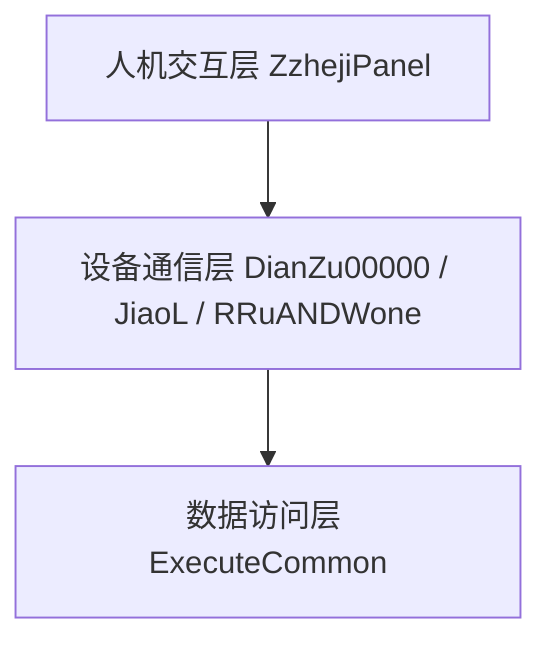
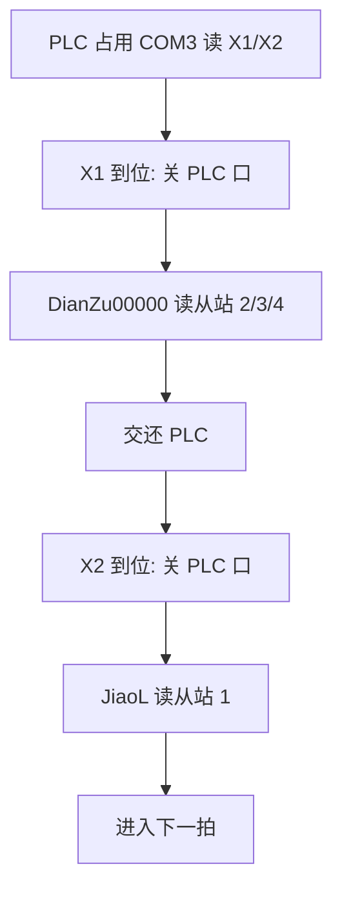
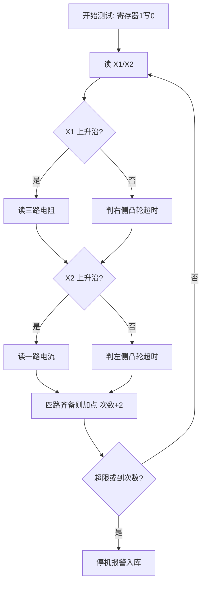
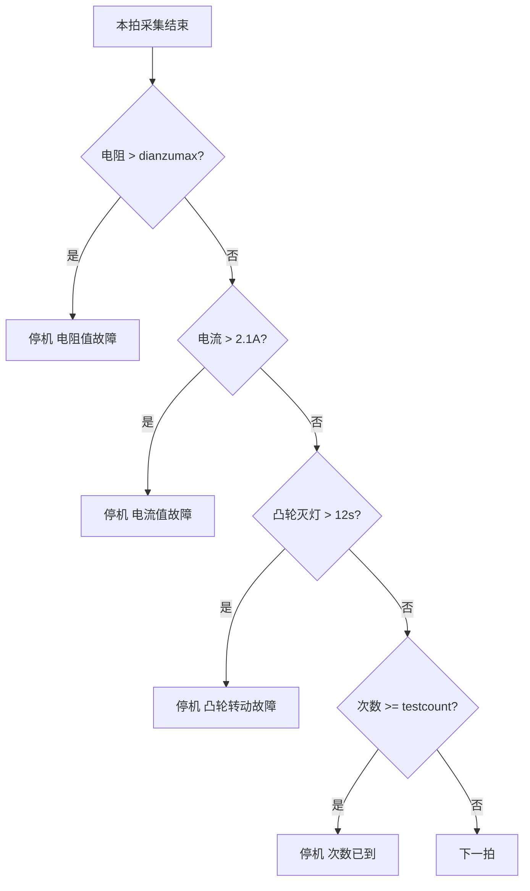
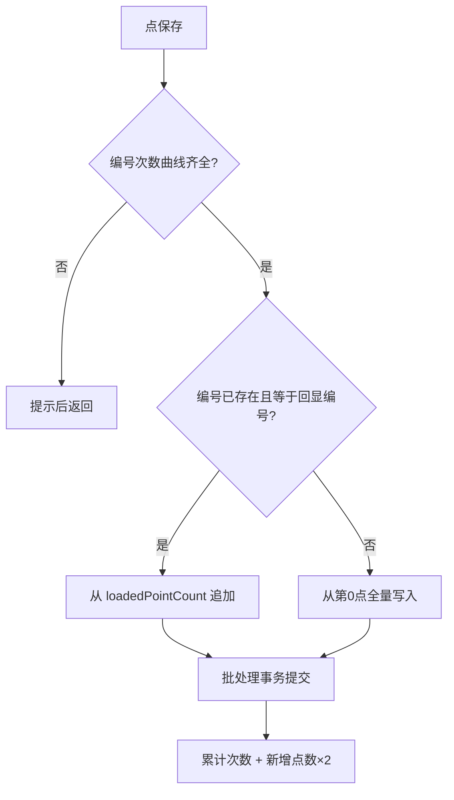
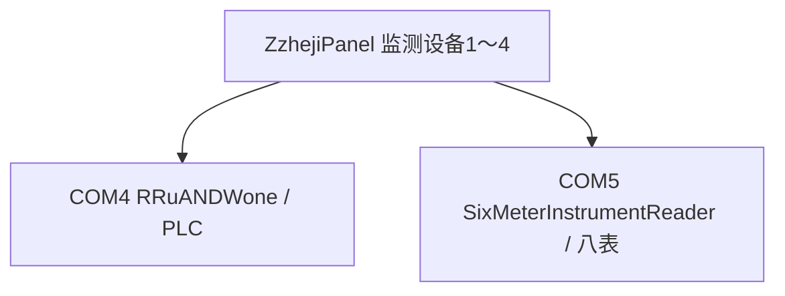
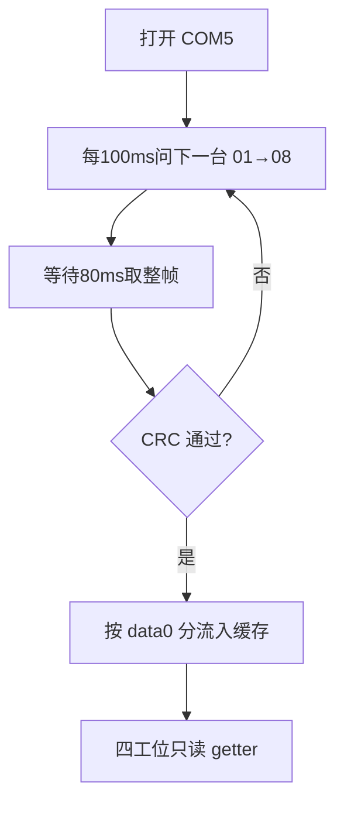

# 继电器接点寿命测试软件
# 功能实现与关键技术分析

课题报告整理稿。整理日期：2026年7月。

依据源码：`ZzhejiPanel.java`、`DianZu00000.java`、`JiaoL.java`、`ExecuteCommon.java`。第 16 节另据 `SixMeterInstrumentReader.java`、`ZzhejiPanel-20260811.java`。

## 摘要

该软件是一套电气接点寿命试验的自动测试与实时监测系统。系统以 PLC/IO 状态识别机械动作阶段，分时读取三路接触电阻和一路电流，完成实时显示、趋势分析、联锁停机、故障记录和历史追溯，形成“控制—采集—分析—报警—存储—追溯”闭环。后续 4 拖 1 方案将控制与测量分到 COM4、COM5。

关键词：继电器接点寿命；状态驱动采集；Modbus-RTU；安全联锁；4拖1

## 1 系统概述

该软件是一套电气接点寿命试验的自动测试与实时监测系统。系统通过 PLC/IO 状态判断机械机构的动作阶段，在不同状态下分时读取三路接触电阻和一路电流，并将采集结果用于实时显示、趋势分析、异常判断、联锁停机、故障记录及历史追溯。

功能闭环为“设备控制—状态识别—参数采集—实时可视化—异常保护—数据存储—历史数据恢复”。`ZzhejiPanel` 承担主界面与业务控制，`DianZu00000` 负责三路电阻，`JiaoL` 负责电流，并依赖 `RRuANDWone`、`ExecuteCommon`、`JdbcDeal`。

核心目标：自动控制启停；按 PLC 状态在合适阶段测量；实时采集三路电阻与一路电流；显示并绘制趋势；超限/超时/到次数时停机报警；数据与故障入库以支持续测和追溯。

## 2 总体架构

系统划分为人机交互层、业务控制层、硬件通信层和数据持久层。主界面展示状态并接收操作；业务层决定何时读设备、何时采集、何时报警；通信层通过串口和 Modbus 与 PLC、电阻模块、电流模块通信；数据层保存试验结果、累计次数和故障信息。

因多设备共享 COM3，通信采用时分复用。异常路径若未及时释放端口，下一模块可能无法通信。后续可设计统一 SerialPortManager。

图2-1 系统四层结构

图2-2 单串口时分复用流程

## 3 系统总体功能

| 序号 | 功能模块 | 主要作用 |
| --- | --- | --- |
| 1 | 测试参数与界面管理 | 显示编号、日期、次数、速度、累计次数、三路电阻、电流及按钮 |
| 2 | 测试编号与历史数据管理 | 输入新编号，或选择旧编号并加载历史曲线 |
| 3 | 测试启动/停止控制 | 切换测试状态，向 PLC 发送启停指令 |
| 4 | PLC 状态监测 | 读取两个输入寄存器，作为采集和速度计算的触发条件 |
| 5 | 三路接触电阻采集 | Modbus RTU 读取地址 2、3、4 |
| 6 | 电流采集 | 串口事件监听读取电流模块 |
| 7 | 实时曲线显示 | JFreeChart 双 Y 轴趋势图 |
| 8 | 速度与次数统计 | 用状态间隔计算速度，维护当前/累计次数 |
| 9 | 故障检测与安全联锁 | 电阻、电流、机构、次数异常时停机报警 |
| 10 | 数据保存与追溯 | 批量保存、故障记录、历史回显、续测增量保存 |

## 4 接触电阻采集

`DianZu00000` 同步轮询从站 2、3、4。打开 COM3 失败时每 50ms 重试，以便抢到 PLC 刚释放的口。对每个从站发送功能码 03H、起始寄存器 1、数量 3 的请求，等待约 50ms 后收应答。应答经 CRC-16 校验后，按原始值、小数位和单位码还原：实际值 = 原始值 / 10^小数位。单位码 3、4、5 分别对应 mΩ、Ω、kΩ。三路单位实际共用同一字段。

## 5 电流采集

`JiaoL` 访问从站 1，组帧方式与电阻相同，收数采用串口监听。单位码 3、4 分别对应 mA、A。主界面调用顺序为：打开并请求 → 睡眠 200ms → 读取缓存字符串 → 关闭串口。电流数字由 `"1.85 A"` 按空格拆出第一段得到。

## 6 PLC通信与控制

PLC 地址为 0x08。上位机循环读取功能码 04H、起始 0、数量 2 的输入寄存器，直到应答功能码确认为 04H。第一字 X1 为右侧凸轮，有效时采集电阻；第二字 X2 为左侧凸轮，有效时采集电流。写寄存器 1 控制运行（0 启动，1 停机），写寄存器 2 控制报警。

## 7 试验流程控制

外层循环控制试验是否继续，内层循环等待本拍电阻采集完成。设计目的是先电阻、后电流，避免在电流信号保持有效时重复读表。X1 上升沿触发三路电阻采集，X2 上升沿触发电流采集，`AtomicBoolean` 用于上升沿闭锁。采集线程只刷新文本框；四个显示框共用 DocumentListener，四路均非空时才加点，次数加 2。

图7-1 试验主循环

操作员进入界面后，系统自动加载电阻停机阈值、累计动作次数和历史试验编号。输入或选择编号后启动测试，上位机向 PLC 发出运行指令。右侧行程开关有效则读三路电阻，左侧有效则读电流。四路数据齐备后曲线加点并计算速度。出现保护条件则停机入库。试验结束后按编号保存；旧编号只追加新点。退出时复位沿标志、计时器和串口。

## 8 动作速度测算

记录相邻两次 X1 有效时刻的间隔 Δt。当 Δt 大于 2 秒时，按 v = 120 / Δt 计算每分钟动作次数。系数 120 相当于 60×2，与曲线横坐标每次步进 2 一致。

## 9 保护停机机制

电阻上限取自 `d_dianzumax.dianzumax`，任一路超限则停机报警。电流超过 2.1A 同样停机。凸轮信号持续无效超过 12 秒判定机构故障。次数达到 `testcount` 后结束试验。故障写入 `policetime`（次数、类型、时间）。

图9-1 四类保护停机判定

## 10 实时曲线监测

左侧纵坐标为电阻，右侧纵坐标为电流，横坐标为动作次数。可视窗口约 28 次。支持最近点读数、滚轮缩放、滚动浏览及分系列显隐。

## 11 数据存储与回放

每个采样点对应 `test_results` 中一行。保存采用 JDBC 批处理事务。新编号全量写入，已回显的旧编号仅追加新点。保存成功后累计次数按新增点数的 2 倍增加。选择已有编号可按横坐标升序回放，并自最大次数继续试验。

图11-1 试验数据保存与回放

## 12 数据库设计

`d_dianzumax` 保存电阻阈值与最大次数；`allcount` 保存累计次数；`test_results` 保存曲线点；`policetime` 保存故障记录。阈值查询与曲线批插分别使用 `DBConnection` 和 `JdbcDeal`。

## 13 通信协议设计

通信采用 Modbus-RTU。请求帧为地址、功能码、起始地址、数量及 CRC（低字节在前）。电阻/电流使用功能码 03H，PLC 使用功能码 04H。CRC-16 初值 0xFFFF，多项式反射形式 0xA001。

系统在 RS-485 总线上采用主从问答。因多设备共享同一串口，上位机在开关量有效时关闭 PLC 通道，再访问从站 2、3、4 和从站 1，完成后交还 PLC。校验失败的数据不进入曲线。

| 顺序 | 占用总线 | 请求帧 | 目的 |
| --- | --- | --- | --- |
| 1 循环 | PLC | 08 04 00 00 00 02 71 52 | 读 2 路输入 |
| 2 | 电阻地址 2 | 02 03 00 01 00 03 54 38 | 读接触电阻 1 |
| 3 | 电阻地址 3 | 03 03 00 01 00 03 55 E9 | 读接触电阻 2 |
| 4 | 电阻地址 4 | 04 03 00 01 00 03 54 5E | 读接触电阻 3 |
| 5 循环 | PLC | 08 04 00 00 00 02 71 52 | 继续盯 X2 |
| 6 | 电流地址 1 | 01 03 00 01 00 03 54 0B | 读回路电流 |

图13-1 一拍内 COM3 访问时序

若应答字节 3、4 为 04 D2（1234），字节 6 为 02，字节 8 为 03，则还原为 12.34 mΩ。

## 14 软件结构

`ZzhejiPanel` 负责人机交互与试验状态机；`DianZu00000`、`JiaoL` 分别完成电阻与电流采集；`ExecuteCommon` 完成数据访问。界面更新位于 EDT，采集任务运行于 3 线程池，电流监听位于串口回调线程。串口互斥依赖关闭后再打开的调用顺序。

主要界面控件：编号框 `testBianHao`，日期 `testTime`，次数 `countTest`，累计次数 `allcountTest`，速度 `suduTest`，电阻 `dianzu111/222/333`，电流显示 `dianzu444`，电流隐藏缓存 `dianzu444NO`。

## 15 关键技术与总结

核心技术：状态驱动式测试；多源数据协同采集；后台线程与界面分离；实时质量判定与联锁保护；数据追溯与试验恢复。

答辩应突出三条主线：状态驱动自动测试；多源参数实时监测；安全联锁与数据追溯。不宜把主要篇幅放在按钮颜色和绝对坐标上。

总结表述：本系统以 PLC 机械状态为测试时序依据，通过串口与 Modbus RTU 协调三路接触电阻、电流及设备控制，在后台线程中完成自动循环测试；同时利用 Swing 和 JFreeChart 实时显示参数及趋势，并结合数据库实现测试数据、累计寿命与异常信息的持久化。出现电阻超限、电流超限、机构超时或达到设定次数时自动停机并记录故障，形成“控制—采集—分析—报警—存储—追溯”闭环。

可能被问到的问题：为什么用后台线程；为什么电阻和电流不同时读取；为什么需要 CRC；为什么使用双 Y 轴；历史续测如何避免重复保存；软件如何保证异常时停止设备。

不足：COM3 缺少统一调度器；两套数据库连接；三路电阻单位共用字段；电流阈值 2.1A 硬编码；固定分辨率绝对布局。

## 16 4拖1方案的多工位拓展

前十五节只分析单工位基础版。本节说明后来做成的 4 拖 1 方案：一台上位机、一块 PLC、一条仪表总线，同时拖四台监测设备。

### 方案含义

界面用 `JTabbedPane` 做成“监测设备1～4”。每台各有启停、状态灯、编号、次数、速度、电阻/电流和一张双轴曲线。接线收成两路：COM4 只连 PLC，COM5 只连八台仪表。一台超限停机，不影响邻站。

图16-1 4拖1双总线结构

### 工位对应关系

| 监测设备 | 电阻从站 | 电流从站 | PLC 凸轮输入 | 运行线圈 |
| --- | --- | --- | --- | --- |
| 1 | 05 | 01 | 第 1、5 字 | 寄存器 1 |
| 2 | 06 | 02 | 第 2、6 字 | 寄存器 2 |
| 3 | 07 | 03 | 第 3、7 字 | 寄存器 3 |
| 4 | 08 | 04 | 第 4、8 字 | 寄存器 4 |

报警共用寄存器 5。状态灯为 stop / Y / N。

### 统一仪表调度

`SixMeterInstrumentReader` 每 100ms 问一台表，地址 01→08 循环，一整轮约 800ms。监听线程 sleep 80ms 后取整帧，CRC 通过后按 `data[0]` 分流写入 `ConcurrentHashMap`。四个试验循环只读缓存，不再开关仪表口。

图16-2 八表轮询与四工位用数

### PLC 与并行试验

PLC 改挂 COM4，地址 0x01，一次读 8 个输入字：`01 04 00 00 00 08 F1 CC`。四个循环共享 `synchronized readAndProcessRegisters()`。写寄存器 1～4 分控运行，写寄存器 5 公共报警。

### 保护、曲线与台账

电阻阈值 `getDianzumaxValue1～4`，电流仍与 2.1 A 比较，凸轮 12 s 超时，次数 `getTestmaxValue1～4`。四张独立双轴图。保存用 `SwingWorker` + `LoadingGifDialog`，行末写设备号。`policetime` 增加 `Shebeihao`。这批 `ExecuteCommon.java` 仍是单记录接口，需与分设备方法对齐。

### 还可继续扩展

调度器按地址取模循环，页签是同构副本，运行线圈按工位号顺延，台账按设备号筛选。源码中残留的 COM5 上 `RRu`/`Wone` 不能与读取器同时打开。4 拖 1 能成立，关键是把问表和用数拆开，并把四套状态彻底隔离。
